# README.md For Milestone Project 1

The purpose of this project was to create a website (front end) of a fictitious organisation to demonstrate the skills that I have developed on my diploma in web development in code institute.

## Table of Contents

#### 1. UX

- Project Goals

- Developer and Business Goals

- User Goals

- User Stories

- Wireframes

#### 2. Features

- Existing Features

- Features Left to Implement 

#### 3. Technologies Used
#### 4. Testing
#### 5. Deployment
#### 6. Credits 

## UX

##### Project Goals

The goal of this project was to create a fully functioning (front end) website to demonstrate the skills and knowledge I have learned and used over the first module in the diploma I am studying. This is to show that I have the skills, knowledge and experience of a Junior Software Developer in working with HTML5, CSS3, Bootstrap, and other applications, with the hope of one day gaining employment within this growing and impactful industry.

##### Developer and Business Goals

The business goal of this hypothetical/fictional website and organisation is to increase foot traffic within the building in the hope of sharing their faith and telling others about the good news of Jesus Christ. 

Other goals that come from this are to raise funds via donations to help and improve the community by improving and adding to the services they are already offering.

##### User Goals

The user goals of this website is to discover more about the organisation (Hope House Christian Community Center) and the services they provide, to join in activities they may enjoy and to learn about the Christian faith. 

##### User Stories

Here is a link to all the information about the user stories used in this project, I recommend checking it out to see the full picture of which features were added and why. It is available to the public, meaning anyone with access to this link should in turn be able to access these user stories:

[User stories link](https://github.com/users/Mark1-15/projects/3)

However, here is a summary of them below (in no particular order): 

1. The website is organised, responsive, and easy to navigate.

    As someone who wishes to view this website for the first time, it should be organised, responsive, and easy to navigate, resulting to an excellent user experience.

2. Contact details, opening hours and location.

    I am interested in what services this organisation can provide, but will need details on the location, opening times, and contact details.

3. Booking Activities.

    I want to be able to see what sort of activities is available and for what group of people these activities are appropriate for, I may also like to be able to book myself into these activities.

4. The website is informative, providing all the information users expect.

    I am interested the ideas behind the creation of this website and its potential services, I wish the website to fully informative, with all areas of the page displaying adequate information about the purpose of the website and the services it provides, allowing me to find the information I want easily.

5. Safety Verification.

    As a government official, I want to ensure all activities in this establishment adhere to the legal guidelines.

6. Engaging images.

    As an artist and graphic designer, I want engaging images on the website, about the activities and theme.

7. Donate Button.

    I strongly believe in supporting those who dedicate their time and energy into making the community a better place, and who give up their time and energy in providing enjoyment for others. Therefore, I would like to financially recompense this group of people for what they do.

(Note: Donate button is a could have instead of a should-have or must-have as it is a mostly charitable organisation who volunteer to keep services going, and would rather individuals donate in person if they feel obliged to, even though financial gain is part of the business goal for the organisation.)

##### Wireframes

Wireframes were used in the preperation of this project to help create the layout of the website that acted as a guide once I had commenced coding. These wireframes were created in the inception phase of this project, as I was planning out ideas. They are seen here:

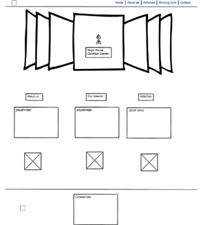
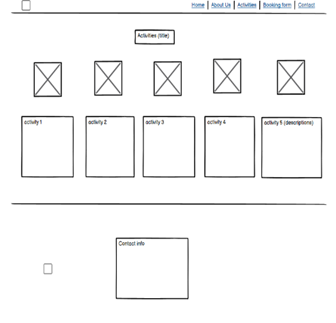
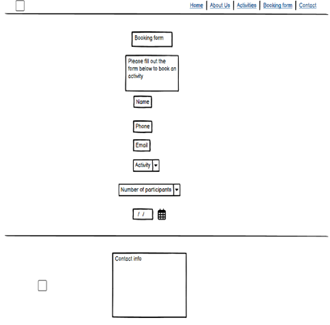
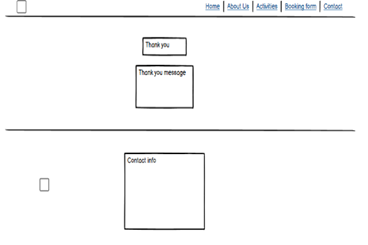

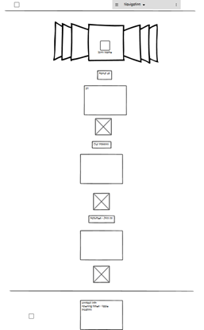
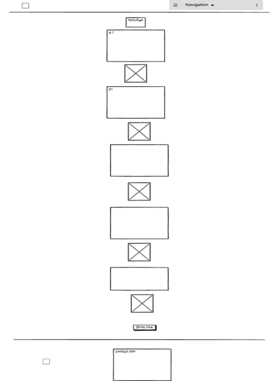
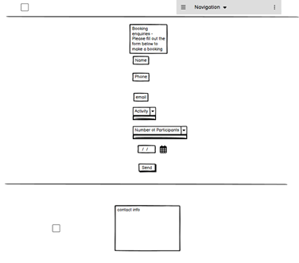
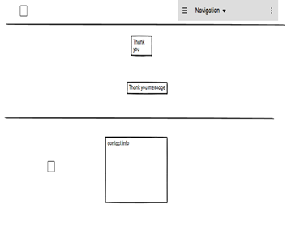

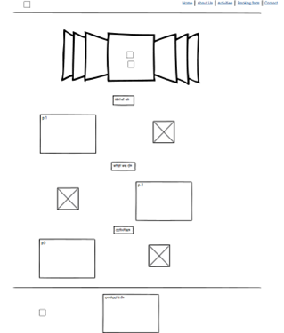
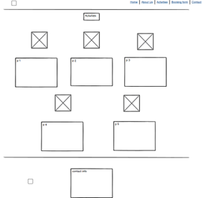

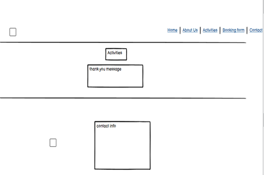

## 2. Features

##### Existing Features
At the conclusion of this project, this front end website is fully functioning and has all of the necessary features that a fully functioning website would need, and the features that were set out in the user stories section. 

This website is easy to navigate, as it is constructed in a way that users would expect. There is a navbar at the top of the page that directs users to the appropriate page/location. The main content in the page is arranged in a way that makes sense and allows easy maneuvering. 

This website is fully reposnsive, and designed to look good regardless of what screen size is being used. A 'mobile-first' approach was used when designing this website as this is the most popular device size that is currently used when surfing the internet and browsing websites, and screen size was upscaled from there and designed in a way that would make it look good on larger screens with the use of media queries and other function.

There is a logo that displays the organisations name, sat in a warm, cozy and comfortable brown emphasising the friendly and welcoming nature of the organisation, and it is located at the top of the page regardless of screen size for all users to see.

There is a footer on every page that can also be navigated to easily with the navbar that contains the organisation's contact information. It contains a phone number and email address, allowing anyone to easily contact the organisation, it has an address that welcomes anyone to the physical building, and it also contains social media links linking users to the organisation's social media pages to discover more about the organisation, its activities while providing an authentic look on what the activities actually look like. Activity times are also noted on the activity card descriptions.

There is a booking page that allows users fo fill out fields, providing personal information about themselves while also allowing the to choose and activity to attend, with the amount of people they intend to bring and choose a specific date for it.

This webside has a carousel, displaying high quality images displaying the kind of atmosphere, environment, and activities this organisation produces.

A modal is also used for costing information and safety verfication. 

##### Features left to implement

Due to time contraints, there are certain 'should-have' priority level features that were unable to be implemented into the project. Though unfortuante, this is not a significant issue as the priority and usefulness of these features was low and the website is still fully functioning and finished without them.

Firstly, a safety verification badge for the refreshments provided would have enhanced the professionalism and authenticity of this website, while also providing a reassurance to anyone with concerns. However, the impact of this is minimal, if any. Despite this a note is left on the modal explaining that this organisation adheres to all food and safety regulation.

Secondly, a donate button was planned to be implemented onto the website to possibly help with the organisation's funding. However, this again is not a significant issue, as the business goal was to increase foot traffic into the building to share the Christian faith and create a community center, which would allow anyone who wished to to provide monetary support in person once they have seen the importance and signifance of this work for the community themselves. 

## 3. Technologies Used

For the creating of this website many technologies were used and utilised to bring about the end result.

First of all was git hub, the site you are probably using to view this project and README.md, the code and supporting documents (images etc.) were written and added to git hub, then commited with a commit message, and then finally pushed. The project section was also utilied to arrange the user stories to monitor progress and provide insight and information on what to do next. 

The social links in the footer section were taken from a previous project in which I had written up code with Code Institute. Because this code was fully functioning the exact code I was going to write up myself, I thought it good developer practice to save time and copy into my project allowing me to work on other features in the project.

As well as the social links, both of the selector inputs in the booking form were also used from the previous boardwalk games project which I had worked on. I originally intended to keep the selector option on how it came from bootstrap, however, this selector option seemed more responsive, easier to navigate, and looked more professional, hence the reason I used this instead of the original option from bootstrap.

## 4. Testing
I had difficulty moving the header logo to the center of the screen on larger devices, thankfully I found a solution on W3Schools, here is the link to the thread:

{Stack overflow link}(https://www.w3schools.com/howto/howto_css_image_center.asp)

I also used previous examples of adding a media query into the css file of the project. Here ia a link to the previous project I worked on coding alongside members from code institute:

{My Boardwalk Games Project}(https://github.com/Mark1-15/boardwalk-games/blob/main/assets/css/style.css)