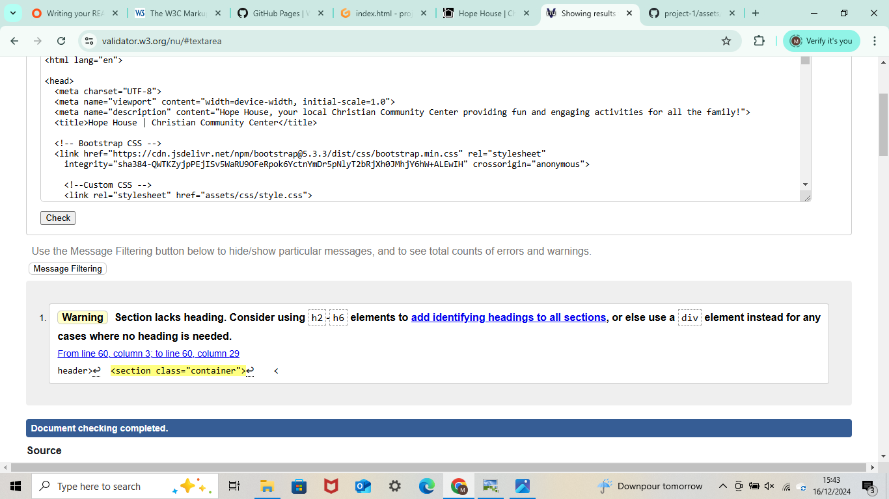
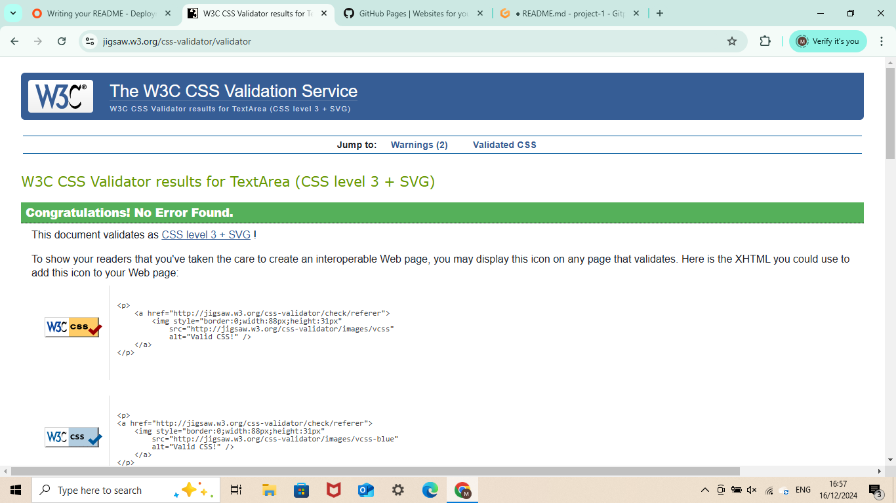
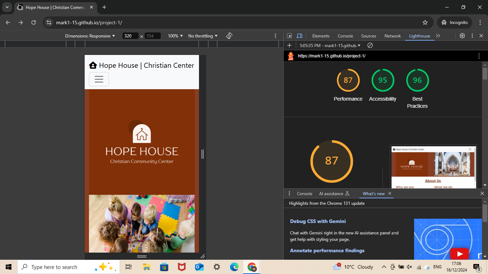
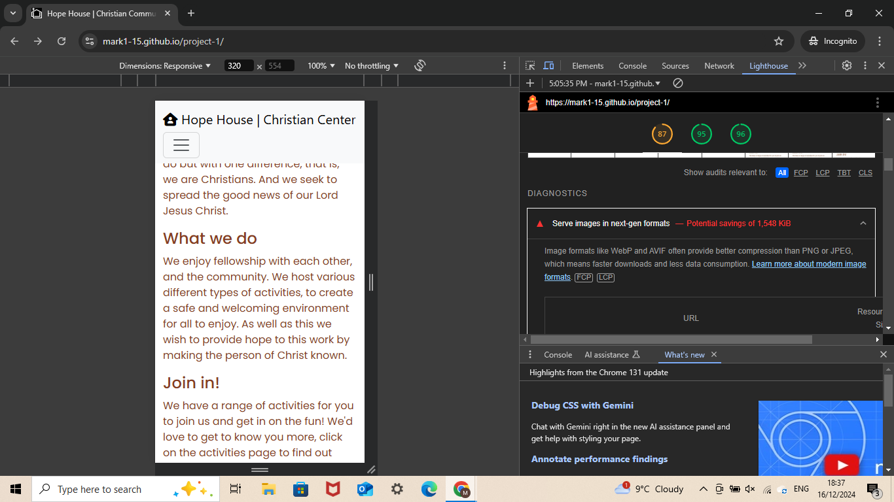
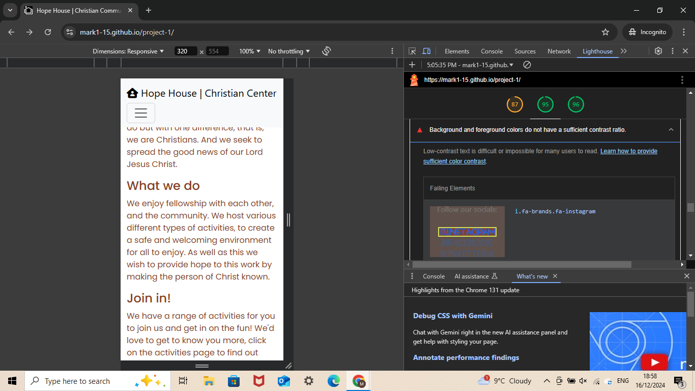

# README.md For Milestone Project 1

The purpose of this project was to create a website (front end) of a fictitious organisation to demonstrate the skills that I have developed on my diploma in web development in code institute.

## Table of Contents

#### 1. UX

- Project Goals

- Developer and Business Goals

- User Goals

- User Stories

- Wireframes

#### 2. Features

- Existing Features

- Features Left to Implement 

#### 3. Technologies Used
#### 4. Testing
#### 5. Deployment
#### 6. Credits 

## UX

##### Project Goals

The goal of this project was to create a fully functioning (front end) website to demonstrate the skills and knowledge I have learned and used over the first module in the diploma I am studying. This is to show that I have the skills, knowledge and experience of a Junior Software Developer in working with HTML5, CSS3, Bootstrap, and other applications, with the hope of one day gaining employment within this growing and impactful industry.

##### Developer and Business Goals

The business goal of this hypothetical/fictional website and organisation is to increase foot traffic within the building in the hope of sharing their faith and telling others about the good news of Jesus Christ. 

Other goals that come from this are to raise funds via donations to help and improve the community by improving and adding to the services they are already offering.

##### User Goals

The user goals of this website is to discover more about the organisation (Hope House Christian Community Center) and the services they provide, to join in activities they may enjoy and to learn about the Christian faith. 

##### User Stories

Here is a link to all the information about the user stories used in this project, I recommend checking it out to see the full picture of which features were added and why. It is available to the public, meaning anyone with access to this link should in turn be able to access these user stories:

[User stories link](https://github.com/users/Mark1-15/projects/3)

However, here is a summary of them below (in no particular order): 

1. The website is organised, responsive, and easy to navigate.

    As someone who wishes to view this website for the first time, it should be organised, responsive, and easy to navigate, resulting to an excellent user experience.

2. Contact details, opening hours and location.

    I am interested in what services this organisation can provide, but will need details on the location, opening times, and contact details.

3. Booking Activities.

    I want to be able to see what sort of activities is available and for what group of people these activities are appropriate for, I may also like to be able to book myself into these activities.

4. The website is informative, providing all the information users expect.

    I am interested the ideas behind the creation of this website and its potential services, I wish the website to fully informative, with all areas of the page displaying adequate information about the purpose of the website and the services it provides, allowing me to find the information I want easily.

5. Safety Verification.

    As a government official, I want to ensure all activities in this establishment adhere to the legal guidelines.

6. Engaging images.

    As an artist and graphic designer, I want engaging images on the website, about the activities and theme.

7. Donate Button.

    I strongly believe in supporting those who dedicate their time and energy into making the community a better place, and who give up their time and energy in providing enjoyment for others. Therefore, I would like to financially recompense this group of people for what they do.

(Note: Donate button is a could have instead of a should-have or must-have as it is a mostly charitable organisation who volunteer to keep services going, and would rather individuals donate in person if they feel obliged to, even though financial gain is part of the business goal for the organisation.)

##### Wireframes

Wireframes were used in the preperation of this project to help create the layout of the website that acted as a guide once I had commenced coding. These wireframes were created in the inception phase of this project, as I was planning out ideas. They are seen here:

## 2. Features

##### Existing Features
At the conclusion of this project, this front end website is fully functioning and has all of the necessary features that a fully functioning website would need, and the features that were set out in the user stories section. 

This website is easy to navigate, as it is constructed in a way that users would expect. There is a navbar at the top of the page that directs users to the appropriate page/location. The main content in the page is arranged in a way that makes sense and allows easy maneuvering. 

This website is fully reposnsive, and designed to look good regardless of what screen size is being used. A 'mobile-first' approach was used when designing this website as this is the most popular device size that is currently used when surfing the internet and browsing websites, and screen size was upscaled from there and designed in a way that would make it look good on larger screens with the use of media queries and other function.

There is a logo that displays the organisations name, sat in a warm, cozy and comfortable brown emphasising the friendly and welcoming nature of the organisation, and it is located at the top of the page regardless of screen size for all users to see.

There is a footer on every page that can also be navigated to easily with the navbar that contains the organisation's contact information. It contains a phone number and email address, allowing anyone to easily contact the organisation, it has an address that welcomes anyone to the physical building, and it also contains social media links linking users to the organisation's social media pages to discover more about the organisation, its activities while providing an authentic look on what the activities actually look like. Activity times are also noted on the activity card descriptions.

There is a booking page that allows users fo fill out fields, providing personal information about themselves while also allowing the to choose and activity to attend, with the amount of people they intend to bring and choose a specific date for it.

This webside has a carousel, displaying high quality images displaying the kind of atmosphere, environment, and activities this organisation produces.

A modal is also used for costing information and safety verfication. 

##### Features left to implement

Due to time contraints, there are certain 'should-have' priority level features that were unable to be implemented into the project. Though unfortuante, this is not a significant issue as the priority and usefulness of these features was low and the website is still fully functioning and finished without them.

Firstly, a safety verification badge for the refreshments provided would have enhanced the professionalism and authenticity of this website, while also providing a reassurance to anyone with concerns. However, the impact of this is minimal, if any. Despite this a note is left on the modal explaining that this organisation adheres to all food and safety regulation.

Secondly, a donate button was planned to be implemented onto the website to possibly help with the organisation's funding. However, this again is not a significant issue, as the business goal was to increase foot traffic into the building to share the Christian faith and create a community center, which would allow anyone who wished to to provide monetary support in person once they have seen the importance and signifance of this work for the community themselves. 

## 3. Technologies Used

For the creating of this website many technologies were used and utilised to bring about the end result.

First of all was git hub, the site you are probably using to view this project and README.md, the code and supporting documents (images etc.) were written and added to git hub, then commited with a commit message, and then finally pushed. The project section was also utilied to arrange the user stories to monitor progress and provide insight and information on what to do next. Markup language has also been used to write up this README.md file. Also, wireframes on Balsamiq was also used as previously seen, as well as drawing down ideas on paper an jotting down useful points.

The social links in the footer section were taken from a previous project in which I had written up code with Code Institute. Because this code was fully functioning the exact code I was going to write up myself, I thought it good developer practice to save time and copy into my project allowing me to work on other features in the project.

As well as the social links, both of the selector inputs in the booking form were also used from the previous boardwalk games project which I had worked on. I originally intended to keep the selector option on how it came from bootstrap, however, this selector option seemed more responsive, easier to navigate, and looked more professional, hence the reason I used this instead of the original option from bootstrap.

An instrumental tool that was used in this project was Bootstrap Version 5.3 (latest version at the time of this project). The navbar, buttons, the caurosuel on the home page,the activity cards on the activity page, and the booking form on the booking form page were all used from bootstrap. This allowed a more efficient development time as I was able to copy the code from the website and implemented into the html files, and spend more time fixing bugs (usually fixing the position of elements). Therefore, I would like to personally thank Bootstrap for its free services, allowing me to use it's code for my project. 

For this project, I also used NCH Suite Pixillion image converter that allowed me to convert the images that I had found online via google images, and convert them all to a similar size to fit inside elements (such as the carousel, cards etc.) and position correctly with CSS if needed. This also hightened the quality of the images by converting them into a jpg/jpeg format. 

Developer Tools on Google Chrome was also a useful tool that was used in the creaton on this website. I was intrumental in getting the website to be fully reponsive, as using is I could locate where bugs were causing issues and what the buds were, and allowed me to test to see if the site fitted correctly onto each creensize with it's 'responsive design' feature. As of writing this I have yet to test the website with lighthouse, however the lighthouse tool in Google Chrome dev kit will be used to test this website in the next section of this README.md.

HTML5 and CSS3 were both used to code, and therefore create this website. Emmet abbreviation from github to code in these was a very useful feature, as this assited me in coding, decraesing the time spend to write out full blocks of code, allowing me to focus my attention else where. 

I would also like to thank Code Institute for teaching me on how to code in HTML5, CSS3, and on how to use many of the tools listed above. There work on previous projects has helped me carve out ideas for myself and use them in the creation of this website, and as already noted, 2 small code snippets from previous projects with them have been used in this project for efficiency and display.

## 4. Testing

##### Bug Fixes

I had difficulty moving the header logo to the center of the screen on larger devices, thankfully I found a solution on W3Schools, here is the link to the thread:

{Stack overflow link}(https://www.w3schools.com/howto/howto_css_image_center.asp)

I also used previous examples of adding a media query into the css file of the project. Here ia a link to the previous project I worked on coding alongside members from code institute:

{My Boardwalk Games Project}(https://github.com/Mark1-15/boardwalk-games/blob/main/assets/css/style.css)

##### Code Testing

I firstly, to test my HTML code I used the industry recognised W3C Markup validator (link below). When I first did this a number of errors arose as the image names that I am using for this project had spaces in the file titles, spaces are invalid for file titles in HTML. I therefore removed the spaces and added a - in it's place. The validator also pointed out that I had used the the ID "about-us" twice, for 2 different elements. Because of this, i changed this attribute from an ID to a class which solved the issue. I then also added a did in the footer socials section, and moved the closing paragraph element which was at the end ov the social links section, closing it off. But this was changed with a div element and the paragraph closing element was moved to after the 'follow our socials:' text. A warning remained as I had not used a specific heading element but this was no issue as no heading element was used until after the logo and carousel in index.html.

For booking-form.html, 

[View HTML Validator here](https://validator.w3.org/)

Secondly, I used the W3C CSS validator (link below) to test my custon CSS. As seen in the image below, no error's were found and all the CSS code created and used is valid and working properly.

[View CSS Validator](https://jigsaw.w3.org/css-validator/validator)

##### Lighthouse

Using Chrome Dev Tools, i was able to use the Lighthouse tool to test the reliability and functionality of the website from a user end point of view. I decided to use incognito mode to run the test as this blocks and web extensions that can falsely hinder results. After first running the test, here are the results I received:

Overall good results from the 3 main scores as can be seen, but taking a closer look at the points noted down a few adjustments could have been made to improve the performance. The main point being that images could have been formatted to a webp or AVIF format for more efficient image compression.

The accessability rating of this website rests at a high score of 95, but a few minor improvements could still be made. One of which was the contrasting of colour between the links and the background colour of the footer, the dark blue colour sitting on a dark brown can be difficult to see, therefore I have created a new CSS class that changes the colour of these social links from the dark blue to a light blue, heavily contrasting the backgrounsd, making it easier to see and more accessable for users.

## 5.Deployment

This project was deployed early in development as per good sofware development practice to help spot bugs as they appeared on a real website and not just a developer environment. Since deployment, there were no bugs that appeared on the live deployment that weren't in the developer environment. Overall the deployment of this website was a smooth experience, with no issues flagging up as a result.

## 6. Credits

Firstly, I would like to thank my mentor for helping me create this project and bring about the final result. He helped me throughout the whole development journey, from brainstorming user stories ideas up to reviewing the code before submission. The useful tips and advice he provide assisted me throught the development of this project. 

I would also like to thank the free technologies that I have been able to use for this project, I will once again mention Bootstrap, Github and Slack for all of these tools that have helped made coding this project possible. 

Last, and certainly not least I would like to once again thank Code Institute. I have learned front end software development in a matter of weeks thank to them and would not have been able to create this project without them. Furthermore, the walkthrough projects throughout this module culminating in this project have been particularly useful. As previously mentioned, 2 small code snippets have been used from previous projects thanks to them. I would not be here without the teaching I have received from Code institute, and hope this project shows the skills I have learned, and now have been able to implement.