# README.md For Milestone Project 1

The purpose of this project was to create a website (front end) of a fictitious organisation to demonstrate the skills that I have developed on my diploma in web development in code institute.

## Table of Contents

#### 1. UX

- Project Goals

- Developer and Business Goals

- User Goals

- User Stories

- Wireframes

#### 2. Features

- Existing Features

- Features Left to Implement 

#### 3. Technologies Used
#### 4. Testing
#### 5. Deployment
#### 6. Credits 

## UX

##### Project Goals

The goal of this project was to create a fully functioning (front end) website to demonstrate the skills and knowledge I have learned and used over the first module in the diploma I am studying. This is to show that I have the skills, knowledge and experience of a Junior Software Developer in working with HTML5, CSS3, Bootstrap, and other applications, with the hope of one day gaining employment within this growing and impactful industry.

##### Developer and Business Goals

The business goal of this hypothetical/fictional website and organisation is to increase foot traffic within the building in the hope of sharing their faith and telling others about the good news of Jesus Christ. 

Other goals that come from this are to raise funds via donations to help and improve the community by improving and adding to the services they are already offering.

##### User Goals

The user goals of this website is to discover more about the organisation (Hope House Christian Community Center) and the services they provide, to join in activities they may enjoy and to learn about the Christian faith. 

##### User Stories

Here is a link to all the information about the user stories used in this project, I recommend checking it out to see the full picture of which features were added and why. It is available to the public, meaning anyone with access to this link should in turn be able to access these user stories:

[User stories link](https://github.com/users/Mark1-15/projects/3)

However, here is a summary of them below (in no particular order): 

1. The website is organised, responsive, and easy to navigate.

    As someone who wishes to view this website for the first time, it should be organised, responsive, and easy to navigate, resulting to an excellent user experience.

2. Contact details, opening hours and location.

    I am interested in what services this organisation can provide, but will need details on the location, opening times, and contact details.

3. Booking Activities.

    I want to be able to see what sort of activities is available and for what group of people these activities are appropriate for, I may also like to be able to book myself into these activities.

4. The website is informative, providing all the information users expect.

    I am interested the ideas behind the creation of this website and its potential services, I wish the website to fully informative, with all areas of the page displaying adequate information about the purpose of the website and the services it provides, allowing me to find the information I want easily.

5. Safety Verification.

    As a government official, I want to ensure all activities in this establishment adhere to the legal guidelines.

6. Engaging images.

    As an artist and graphic designer, I want engaging images on the website, about the activities and theme.

7. Donate Button.

    I strongly believe in supporting those who dedicate their time and energy into making the community a better place, and who give up their time and energy in providing enjoyment for others. Therefore, I would like to financially recompense this group of people for what they do.

(Note: Donate button is a could have instead of a should-have or must-have as it is a mostly charitable organisation who volunteer to keep services going, and would rather individuals donate in person if they feel obliged to, even though financial gain is part of the business goal for the organisation.)

##### Wireframes

Wireframes were used in the preperation of this project to help create the layout of the website that acted as a guide once I had commenced coding. These wireframes were created in the inception phase of this project, as I was planning out ideas. They are seen here:

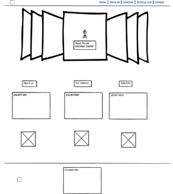
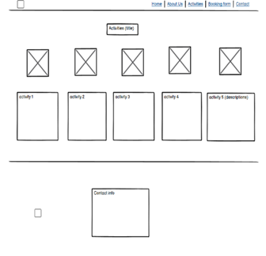
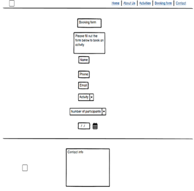
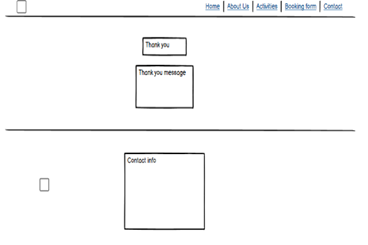

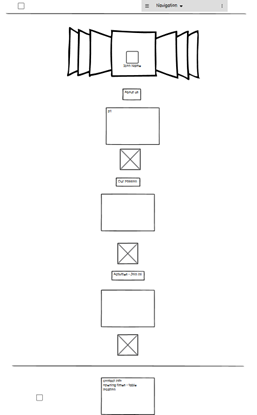
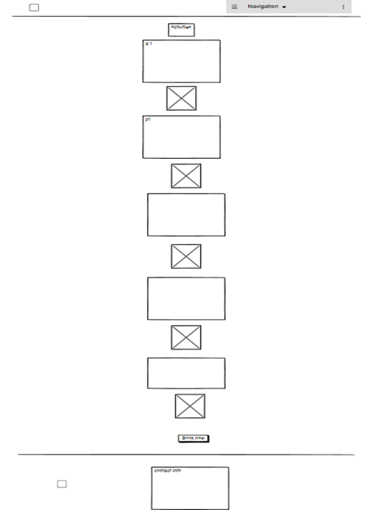
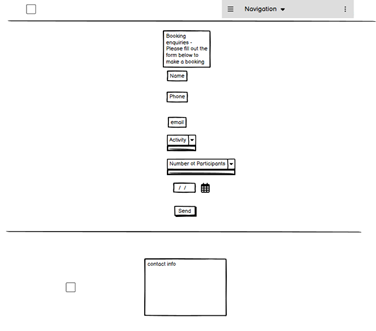
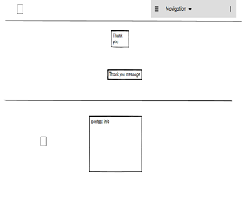

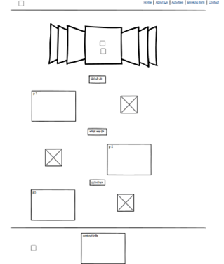
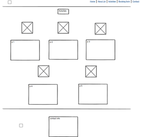
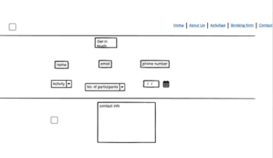
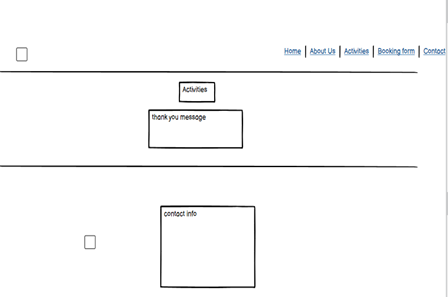

## 4. Testing
I had difficulty moving the header logo to the center of the screen on larger devices, thankfully I found a solution on W3Schools, here is the link to the thread:

{Stack overflow link}(https://www.w3schools.com/howto/howto_css_image_center.asp)

I also used previous examples of adding a media query into the css file of the project. Here ia a link to the previous project I worked on coding alongside members from code institute:

{My Boardwalk Games Project}(https://github.com/Mark1-15/boardwalk-games/blob/main/assets/css/style.css)